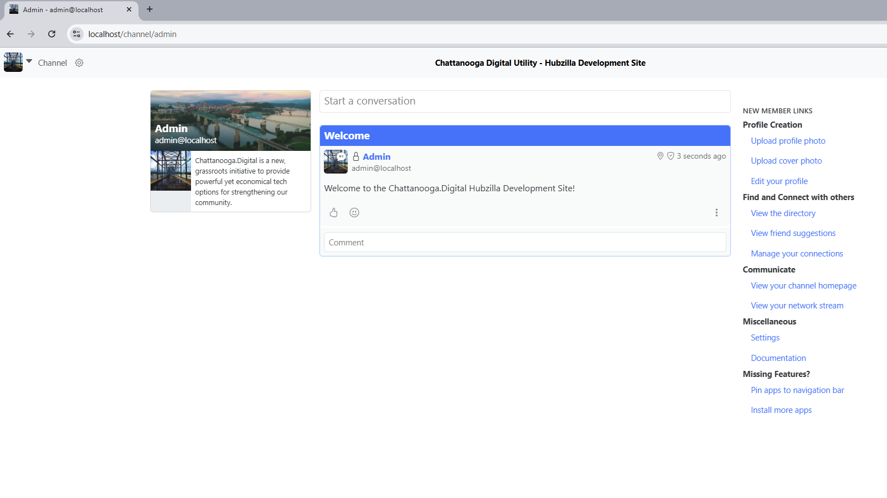
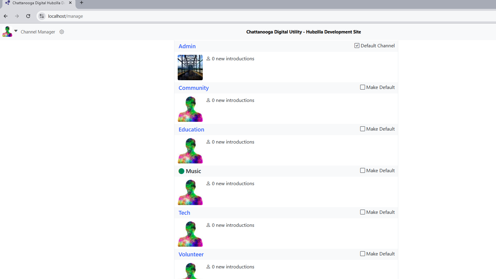

# Hubzilla Docker Deployment

A fully containerized Hubzilla setup supporting both local development and staging deployment to Portainer/Docker Swarm.

## Features

- **HTTPS with valid certificates** - Local: mkcert, Staging/Production: Let's Encrypt via Traefik
- **PostgreSQL database** - Persistent data storage
- **Multiple deployment modes** - Local development or Docker Swarm/Portainer deployment
- **Integrated mail server** - Stalwart for SMTP/IMAP

---
## Disclaimer

This project was developed with AI assistance and is provided "as-is" without warranty. Please research any commands before running them. This code is in early development and may contain bugs.

---
## Deployment Environments

This repository supports two deployment scenarios (Local Development and Staging Deployment to Portainer):

### For Local Development
Full stack with HTTPS using `docker-compose.yml` for local experimentation.

**Quick Setup for Local Development:**
1. Copy `.env.local.example` to `.env`
2. Configure `MKCERT_PATH` for local SSL
3. Run `docker compose up -d`

See [Quick Start](#quick-start-local-development) below for detailed instructions.

### For Staging (Portainer)
Docker Swarm deployment via Portainer using `docker-stack.yml` with Let's Encrypt SSL.

**Quick Setup for Staging:**
1. Copy `.env.staging.example` to `.env` and customize for your domain
2. Create three Docker Secrets in Portainer (db_password, smtp_password, stalwart_admin_password)
3. Deploy stack in Portainer using Git repository method

See [Staging Deployment](#staging-deployment-portainer) below for detailed instructions, or the complete [Staging Deployment Guide](docs/STAGING_DEPLOYMENT.md).

---

## Quick Start (Local Development)

### Prerequisites
- Docker & Docker Compose
- Git
- mkcert (for SSL certificates)


### 1. SSL Setup
```bash
# Debian-based Linux/WSL
sudo apt install mkcert

# macOS  
brew install mkcert

# Windows: Download from https://github.com/FiloSottile/mkcert/releases
# NOTE: For Windows+WSL2, install mkcert on Windows host (not WSL2)
# This ensures mkcert -install adds the CA to Windows certificate store

# Initialize (one-time setup) - MUST run as Administrator
mkcert -install
# Confirms popup to add CA to Windows certificate store

# If automatic installation fails in Windows, manually add certificate:
# 1. Press Win+R → type 'mmc' → Add Certificates snap-in → Computer account
# 2. Navigate: Trusted Root Certification Authorities → Certificates
# 3. Right-click → All Tasks → Import → Select rootCA.pem from mkcert -CAROOT path
```

### 2. Clone and Configure
```bash
git clone https://github.com/Chattanooga-Digital-Dev/hubzilla.git
cd hubzilla

# Copy the local development template
cp .env.local.example .env
```

**Edit .env file:**
1. Find your mkcert path: `mkcert -CAROOT`
2. Set `MKCERT_PATH` in .env to that exact path

**Common paths:**
- Linux/WSL: `MKCERT_PATH=~/.local/share/mkcert`
- macOS: `MKCERT_PATH=~/Library/Application Support/mkcert`
- Windows+WSL2: `MKCERT_PATH=/mnt/c/Users/USERNAME/AppData/Local/mkcert`

### 3. Build and Start
```bash
docker compose build --no-cache
docker compose up -d

# Monitor startup (optional)
docker logs -f hubzilla_itself
# Exit with Ctrl+C when you see "Starting php-fpm"
```

### 4. Complete Setup
1. **Open setup wizard:** https://localhost

2. **Database configuration (Step 2):**
   ```
   Database Server Name: hub_db
   Database Port: 5432
   Database Login Name: hubzilla
   Database Login Password: P@55w0rD
   Database Name: hub
   Database Type: PostgreSQL
   ```

3. **Create admin account (Step 3):** 
- Use admin@example.com for the email address

4. **Complete remaining steps** in the wizard

### 5. Access Your Site
Your Hubzilla instance: **https://localhost**  
Stalwart mail admin: **https://mail.localhost**

---

## Staging Deployment (Portainer)

Deploy to Docker Swarm using Portainer's web interface with automatic SSL via Let's Encrypt.

### Prerequisites
- Portainer access on your Docker Swarm server
- External Traefik network (`traefik_net`) already configured
- Domain name pointing to your server

### Step 1: Prepare Environment Configuration

**On your local machine:**
```bash
# Clone repository
git clone https://github.com/Chattanooga-Digital-Dev/hubzilla.git
cd hubzilla

# Copy staging template
cp .env.staging.example .env
```

**⚠️ CRITICAL:** Use `.env.staging.example` as your template. 
Do NOT copy `.env.local.example` for staging - it's for local development only and contains 
passwords directly in the file, which is insecure for production.


**Edit .env and customize:**
```bash
DOMAIN=hubzilla.yourdomain.com              # Your domain
ADMIN_EMAIL=admin@yourdomain.com            # Admin email
SMTP_DOMAIN=yourdomain.com                  # Email domain
```

**Important:** Do NOT add passwords to `.env` - those use Docker Secrets (next step).

### Step 2: Create Docker Secrets

**In Portainer:**
1. Navigate to **Secrets** → **Add Secret**
2. Create each secret with a strong password:

| Secret Name | Description |
|-------------|-------------|
| `hubzilla_db_password` | Database password |
| `hubzilla_smtp_password` | SMTP/email password |
| `hubzilla_stalwart_admin_password` | Mail server admin password |

**Example:**
```
Name: hubzilla_db_password
Secret: your_strong_random_password_here
```

### Step 3: Deploy Stack in Portainer

**Method 1: Git Repository (Recommended)**

1. **Portainer** → **Stacks** → **Add Stack**
2. **Name:** `hubzilla`
3. **Build method:** Git Repository
4. **Configuration:**
   - Repository URL: `https://github.com/Chattanooga-Digital-Dev/hubzilla`
   - Branch: `staging`
   - Compose path: `docker-stack.yml`
5. **Environment variables:**
   - Load from `.env` file (automatic)
   - Or manually paste your customized `.env` contents
6. **Deploy Stack**

**Method 2: Web Editor**

1. **Portainer** → **Stacks** → **Add Stack**
2. **Name:** `hubzilla`
3. **Build method:** Web editor
4. Copy/paste contents of `docker-stack.yml`
5. Manually add all environment variables from your `.env`
6. **Deploy Stack**

### Step 4: Verify Deployment

1. **Check services:** Portainer → Stacks → hubzilla → All services should show `1/1`
2. **Check logs:** Click on `hubzilla_hub` service → Container → Logs
3. **Look for:** `======== NETWORK: Added yourdomain.com -> 10.0.1.x to /etc/hosts ========`
4. **Access site:** `https://hubzilla.staging.chattanooga.digital`

## Retrieving Registration Tokens
When users register with approval required (`REGISTER_POLICY=REGISTER_APPROVE`), you can retrieve tokens to approve accounts.

### Via Portainer Console
1. **Navigate:** Stacks → hubzilla → `hubzilla_hub_db` service
2. Click running container
3. **Console** tab → **Connect**
4. Run query:
   ```bash
   psql -U hubzilla -d hub -x -c "SELECT reg_email, reg_hash FROM register;"
   ```

### Updating Deployment

When you push changes to GitHub:

1. **Portainer** → **Stacks** → **hubzilla** → **Editor**
2. Click **Pull and redeploy**
3. ✅ Check **Prune services**
4. ❌ **NEVER check** "Remove volumes" (will delete all data)
5. Click **Update**

### Complete Guide

For detailed troubleshooting, network architecture, and advanced configuration, see the complete [Staging Deployment Guide](docs/STAGING_DEPLOYMENT.md).

---

## Screenshots

### Channel Homepage
[](docs/screenshots/ChannelHome.png)

### Channels Overview
[](docs/screenshots/channels.png)

---

## Container Overview

| Service | Purpose | Ports |
|---------|---------|-------|
| `traefik` | HTTPS reverse proxy | 80, 443, 8082 |
| `hub` | Hubzilla (nginx + PHP-FPM) | - |
| `hub_db` | PostgreSQL database | 5432 |
| `hub_cron` | Background tasks | - |
| `stalwart` | Local mail server | 25, 143, 587, 993, 465 |

**Note:** This table describes the local development setup. Staging/production deployments use external Traefik on a dedicated overlay network. See [Staging Deployment Guide](docs/STAGING_DEPLOYMENT.md) for details.

---

## Development Commands

```bash
# View logs
docker compose logs
docker logs -f hubzilla_itself

# Access containers
docker exec -it hubzilla_itself bash
docker exec -it hubzilla_database psql -U hubzilla -d hub

# Restart services
docker compose restart

# Stop everything
docker compose down
```

---

## Email Verification

**Option 1:** Configure the included Stalwart mail server and Thunderbird email application 
- (see [docs/EMAIL_CONFIG.md](docs/EMAIL_CONFIG.md)) for instructions

**Option 2:** Manual verification
```bash
# Get verification token
docker exec hubzilla_itself sh -c 'PGPASSWORD="${DB_PASSWORD}" psql -h "${DB_HOST}" -p "${DB_PORT}" -U "${DB_USER}" -d "${DB_NAME}" -c "SELECT reg_hash FROM register WHERE reg_email='\''your-email@example.com'\'';"'

# Visit: https://localhost/register/verify/YOUR_TOKEN_HERE
```

---

## Troubleshooting

**Containers won't start:**
```bash
docker compose ps
docker compose logs
```

**Database connection errors:**
```bash
# Wait 30-60s for database initialization on first start
docker logs hubzilla_database
```

**Reset everything:**
```bash
docker compose down
docker volume rm hubzilla_db_data hubzilla_web_root hubzilla_ssl_certs hubzilla_stalwart_data hubzilla_traefik_certs
docker compose up -d
```

---

## Documentation

- [Staging Deployment Guide](docs/STAGING_DEPLOYMENT.md) - Complete Portainer deployment guide
- [SSL Setup Details](docs/SSL_SETUP.md) - mkcert configuration for local development
- [Email Configuration](docs/EMAIL_CONFIG.md) - Stalwart mail server setup
- [Environment Variables](docs/ENVIRONMENT.md) - Complete .env reference
- [Development Guide](docs/DEVELOPMENT.md) - Advanced commands and debugging
- [Email-to-Calendar](docs/EMAIL_CALENDAR.md) - Calendar processing features
- [Production Guide](docs/PRODUCTION.md) - Production deployment considerations

---

## Contributing

1. Fork the repository
2. Create feature branch: `git checkout -b feature-name`
3. Test changes: `docker compose down && docker compose build --no-cache && docker compose up -d`
4. Commit: `git commit -m "Description"`
5. Submit pull request

---

## License

MIT License - see [LICENSE](LICENSE) file for details.

Based on [dhitchenor/hubzilla](https://github.com/dhitchenor/hubzilla).
