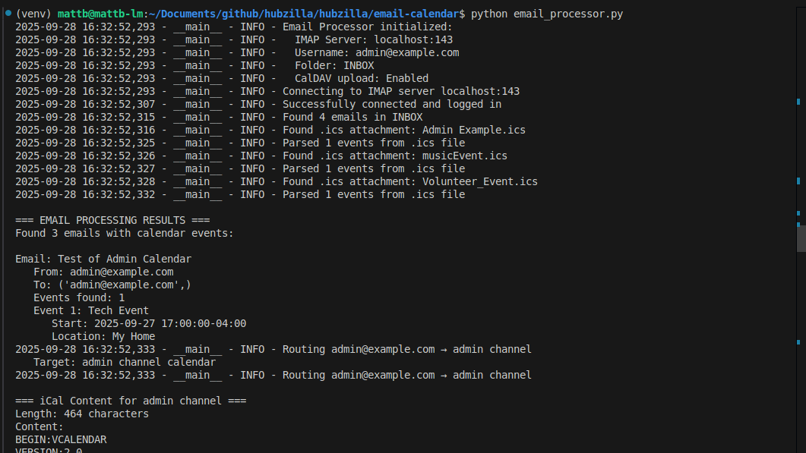
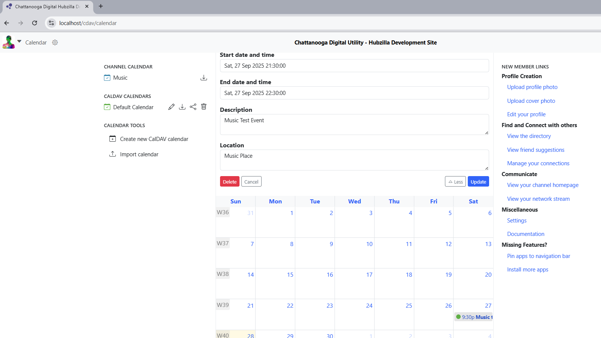

# Email-to-Calendar Processing

Python application that processes emails with calendar attachments and uploads events to Hubzilla channels.

## Setup
```bash
cd email-calendar
python3 -m venv venv
source venv/bin/activate          # Linux/macOS/WSL
pip install -r requirements.txt
```

## Usage
```bash
# From email-calendar directory
python email_processor.py
```
**Note:** Currently requires manual execution. Automatic processing via cron job is planned for future development.

### Email Processor in Action
[](screenshots/email_processor.png)

## Configuration
Uses environment variables from project root `.env`:
```bash
SMTP_USER=admin@yourdomain.com
STALWART_ADMIN_PASSWORD=admin123
LOG_LEVEL=DEBUG
```

## Channel Routing
Events route to channels based on email recipient:

| Email | Channel | Purpose |
|-------|---------|---------|
| tech@yourdomain.com | tech | Technical meetups |
| music@yourdomain.com | music | Concerts, performances |
| education@yourdomain.com | education | Classes, workshops |
| volunteer@yourdomain.com | volunteer | Volunteer opportunities |
| community@yourdomain.com | community | Community events |
| admin@yourdomain.com | admin | Fallback |


## Testing
1. Send email with `.ics` attachment to configured address
2. Run email processor
3. Check corresponding Hubzilla channel calendar for uploaded event

### Calendar Event Example
[](screenshots/CalendarExample.png)

## How It Works
1. Connects to Stalwart IMAP server
2. Extracts `.ics` files from email attachments
3. Sanitizes content (removes problematic characters/formatting)
4. Routes to appropriate channel based on recipient
5. Uploads to Hubzilla via CalDAV
