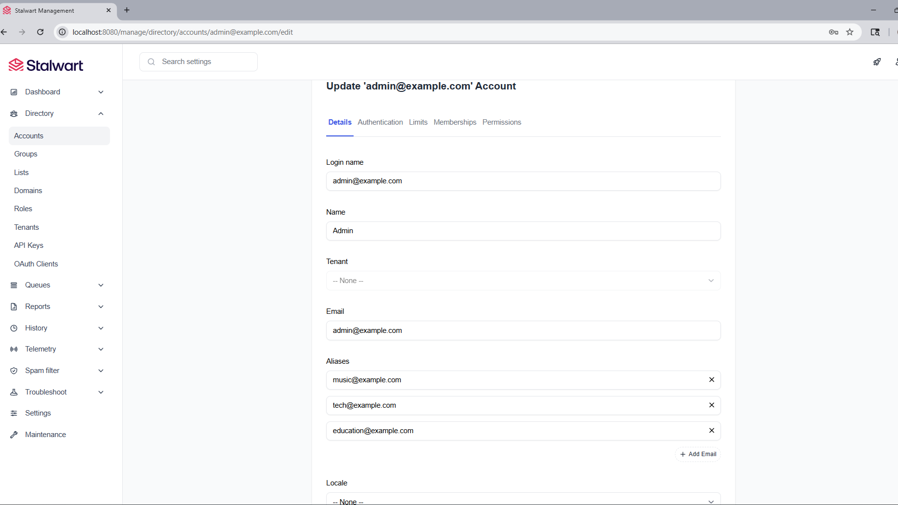
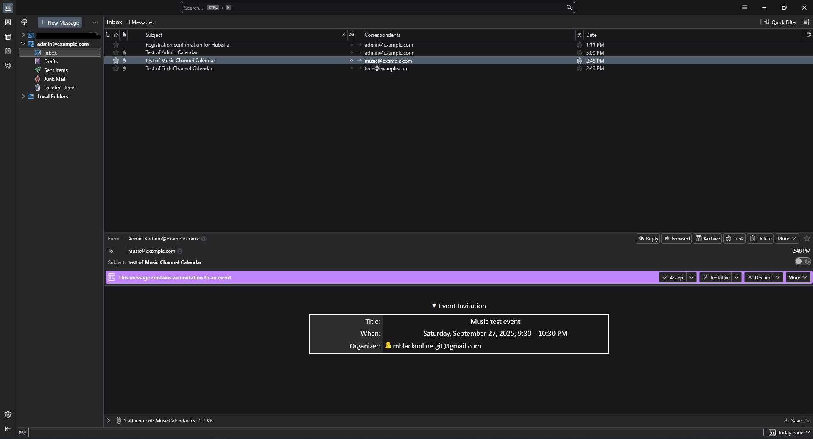

# Email Configuration

## Stalwart Mail Server Setup

### Access Admin Interface
- URL: https://localhost:8080
- Login: `admin` / password from `.env` (`STALWART_ADMIN_PASSWORD`)

[](screenshots/Stalwart.png)

### Create Domain
1. Go to "Domains" → Create new domain: `example.com`

### Create Admin Account
1. Go to "Accounts" → Create account:
   - Name: Admin
   - Login: admin@example.com
   - Email: admin@example.com
   - Password: Same as `STALWART_ADMIN_PASSWORD`

### Create Channel Aliases
Create these aliases under admin@example.com:
- tech@example.com
- music@example.com
- education@example.com
- volunteer@example.com
- community@example.com

## Email Client Setup (Thunderbird)
- Account: admin@example.com
- IMAP: localhost:993 (SSL/TLS)
- SMTP: localhost:587 (STARTTLS)
- Password: Value from `STALWART_ADMIN_PASSWORD`

[](screenshots/Thunderbird.png)

## Troubleshooting Thunderbird & Stalwart
- If Thunderbird won’t trust your local HTTPS endpoint, you probably need to import your mkcert CA under Authorities:
   1. Open Preferences → Privacy & Security → Certificates → View Certificates…

   2. Select the Authorities tab

   3. Click Import… and choose your mkcert rootCA.pem (default locations):

      - Linux/macOS (Homebrew, APT): $HOME/.local/share/mkcert/rootCA.pem

      - macOS (official pkg or brew install): $HOME/Library/Application Support/mkcert/rootCA.pem

      - Windows (choco, Scoop, manual): %APPDATA%\mkcert\rootCA.pem

   4. Tick Trust this CA to identify websites, click OK, then restart Thunderbird.

## Bypass Email Verification
```bash
# Get verification token
docker exec hubzilla_itself sh -c 'PGPASSWORD="${DB_PASSWORD}" psql -h "${DB_HOST}" -p "${DB_PORT}" -U "${DB_USER}" -d "${DB_NAME}" -c "SELECT reg_hash FROM register WHERE reg_email='\''your-email@example.com'\'';"'

# Visit: https://localhost/register/verify/TOKEN
```
